# 🍴 hungr.

### Swipe. Match. Eat.

**NUS Orbital 2026 Apollo 11**

**Team:** Tan Jeng Khiang Damien, Jenna Ng Kai Ern

Milestone 1 submission

## Table of Contents

1. [Motivation](#1-motivation)
2. [Aim & Vision](#2-aim--vision)
3. [User Profiling](#3-user-profiling)
4. [User Stories](#4-user-stories)
5. [Scope & Tech Stack](#5-scope--tech-stack)
6. [System Architecture](#6-system-architecture)
7. [Database Schema](#7-database-schema)
8. [Features](#8-features)
9. [Match Detection](#9-match-detection)
10. [Milestone Plan](#10-milestone-plan)
11. [Software Engineering Practices](#11-software-engineering-practices)
12. [Running Locally](#12-running-locally)

---

## 1. Motivation

Deciding where to eat as a pair or group is a universally frustrating experience. We are
always spoiled for choice, so reaching a consensus on where to dine is often exhausting and
the conversations are circular
*"Where do you want to go?" 
"I don't know, where do you want to go?"*

**Hungr** is a shared food decision-making app where groups swipe simultaneously on nearby
dining options, drawing on the intuitive, low-effort mechanics that made dating apps so
widely adopted. By surfacing only the options the whole group collectively likes, users skip
the back-and-forth entirely and arrive at a decision everyone is happy with — turning a
recurring social frustration into something efficient and even enjoyable.

---

## 2. Aim & Vision

Hungr will be a cross-platform mobile app that helps any group reach a **unanimous dining
decision in under a minute** of playful swiping. Each member is shown the same deck of nearby
restaurants and swipes right to like or left to pass; the app collects everyone's preferences
and computes the option the group *collectively* wants.

| Principle | What it means |
|-----------|---------------|
| **Effortless** | Decisions done via the app, no debating required. |
| **Fair** | Results revealed only once every member finishes swiping. |
| **Relevant** | Real restaurants pulled live from Google Places, sorted by proximity. |

**Long-term vision:** the default tool friend groups, couples, and colleagues reach for
whenever "where should we eat?" comes up.

---

## 3. User Profiling

Hungr targets **small social groups (2–6 people)** who eat out together.

| Persona | Need |
|---------|------|
| **Indecisive Friends** | Deciding on a place to eat |
| **Couples** | Discover somewhere new that *both* genuinely like. |
| **Distant Friends** | Decide where to eat when you do not know what each other likes |

---

## 4. User Stories

**Core**

1. As a group of friends, we can **create a session and invite members via a shared code**, so everyone participates at the same time.
2. As a session host, I can **filter restaurants by price, location, and cuisine**, so only relevant options appear.
3. As a group member, I can **swipe right/left and see a match** when all members like the same option.
4. As a user, I can **save restaurants to a personal favourites list**.
5. As a returning user, I can **sign in to a secure account** so my data persists.

**Extensions**

6. View a **history of past sessions** and how the group ranked each restaurant.
7. Set **cuisine preferences** on my profile to pre-tune sessions.
8. Seed a session's deck from the group's **combined favourites**.

---

## 5. Scope & Tech Stack

| Layer | Technology | Why |
|-------|-----------|-----|
| Mobile frontend | React Native (Expo, expo-router) | One codebase for iOS & Android. |
| Backend API | Node.js + Express (TypeScript) | Lightweight typed REST layer. |
| Database | Supabase (PostgreSQL) | Managed Postgres with RLS + Realtime. |
| Authentication | Supabase Auth | Secure email/password sessions. |
| Restaurant data | Google Places API | Location-aware restaurant data & photos. |

**In scope (M1):** auth · location-based fetch · session create/join via code · shared
20-restaurant deck · swipe UI · most-liked result.
**Out of scope (later):** filtering · session history · combined-favourites seeding · polish.

---

## 6. System Architecture

Hungr follows a **three-tier architecture**. The Expo client talks only to our Express API,
which holds the Supabase service-role key and brokers all access to the database and Google
Places

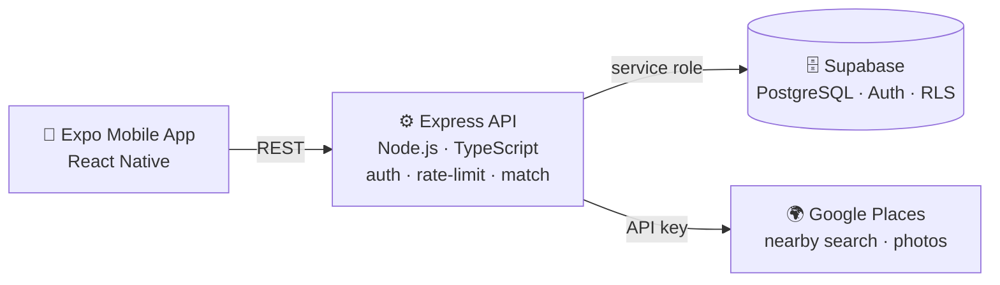

**Key design decisions**

- **Session-scoped decks** — the host's "start" freezes 20 restaurants in `session_restaurants`; everyone swipes the *same* deck, making matches meaningful.
- **Server-side match detection** — unanimous like = match; otherwise the most-liked restaurant is the fallback pick.
- **Polling for sync** — a 3-second poll propagates session state, avoiding RLS pitfalls; Supabase Realtime is an optional fast path.
- **Per-user rate limiting** — throttled per authenticated user, not per IP.

---

## 7. Database Schema

Managed through versioned SQL migrations

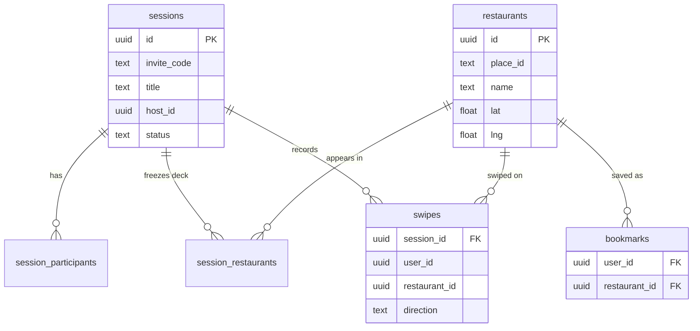

| Table | Responsibility |
|-------|----------------|
| `restaurants` | Cached records keyed by Google `place_id`. |
| `sessions` | A group swipe session (host, title, code, status). |
| `session_participants` | Membership + per-member "finished swiping" flag. |
| `session_restaurants` | The frozen 20-restaurant deck. |
| `swipes` | Each member's like/nope per restaurant. |
| `bookmarks` | A user's personal saved restaurants. |

---

## 8. Features

### Authentication
Sign up (with email verification), log in, and reset password via Supabase Auth. Every API
request carries the session token, scoping all data to the user.

| Login | Sign up | Profile |
|:---:|:---:|:---:|
| 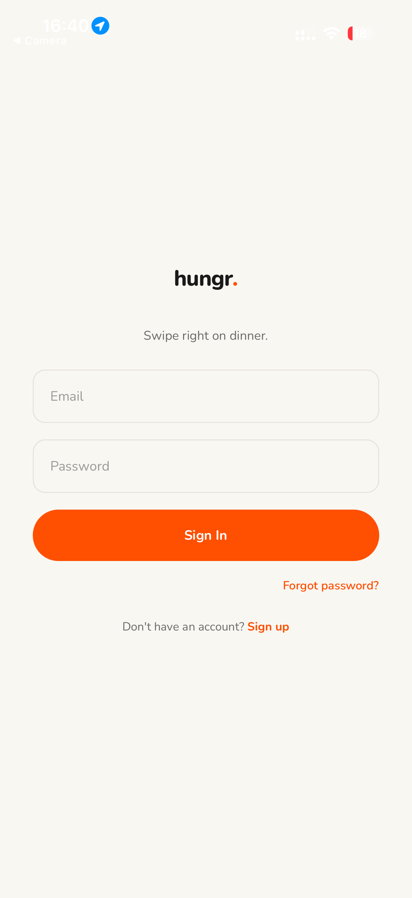 | 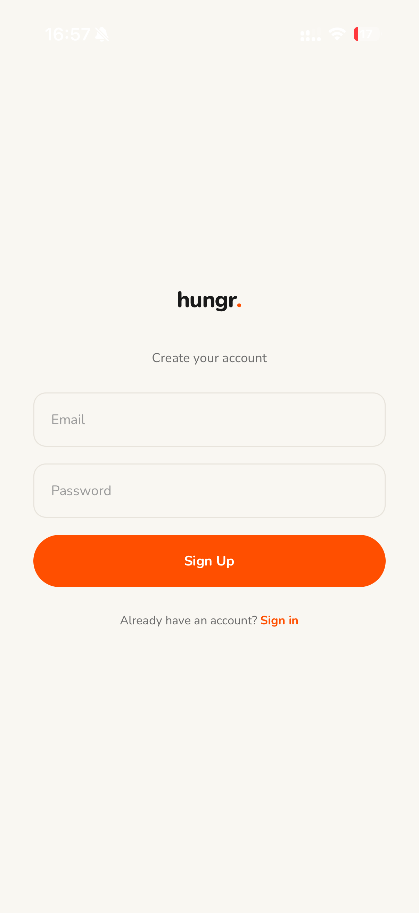 | 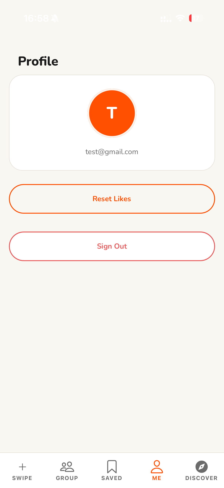 |

### Discover Nearby Restaurants
The Discover tab requests location and fetches nearby restaurants live from Google Places via
the backend. Any restaurant can be saved to favourites.

| Discover | Restaurant detail | Favourites |
|:---:|:---:|:---:|
| 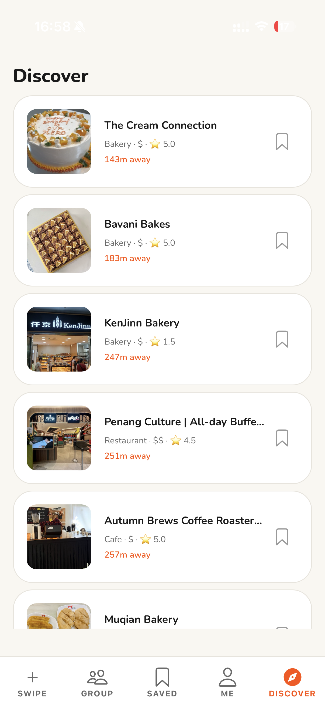 | 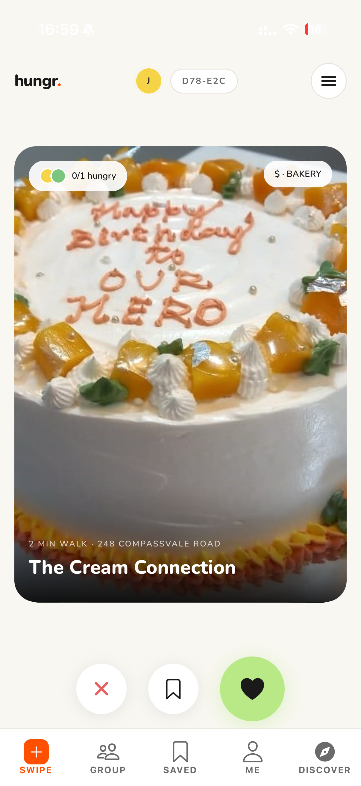 | 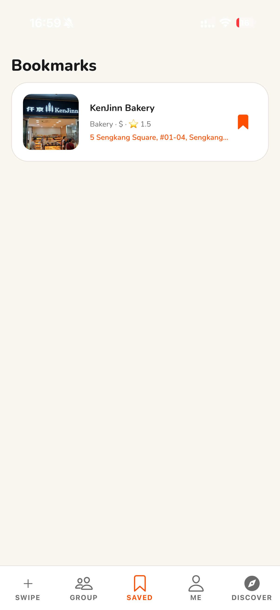 |

### Sessions & Swiping
A host creates a session with a title → unique invite code. Members join with the code; the
host starts, freezing the deck. Everyone swipes the same cards with reanimated gestures.

| Sessions | Lobby & code | Swiping |
|:---:|:---:|:---:|
| 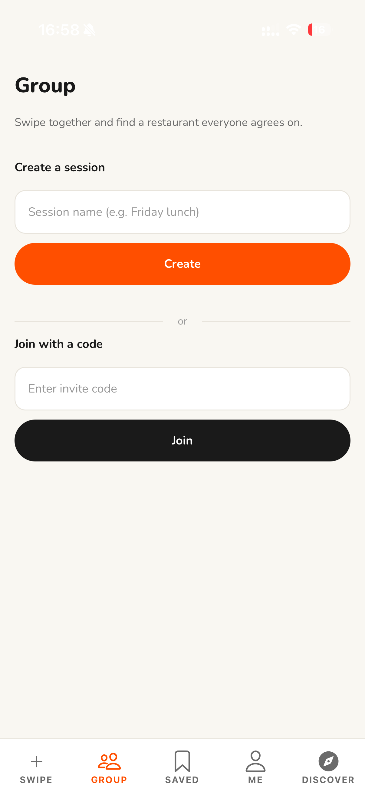 | 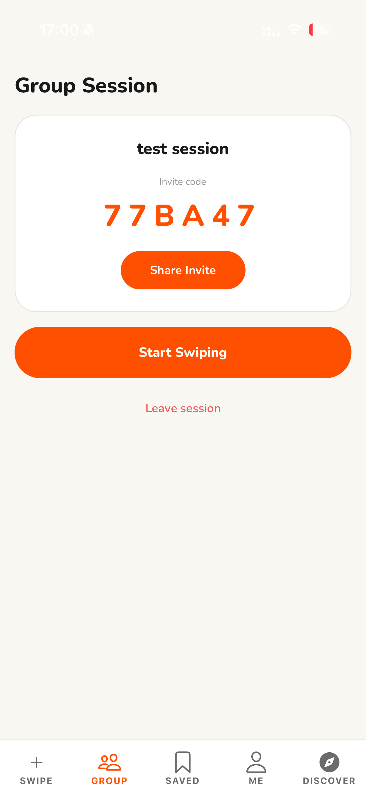 |  |

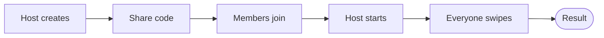

---

## 9. Match Detection

Once all participants finish, the backend tallies likes per restaurant.

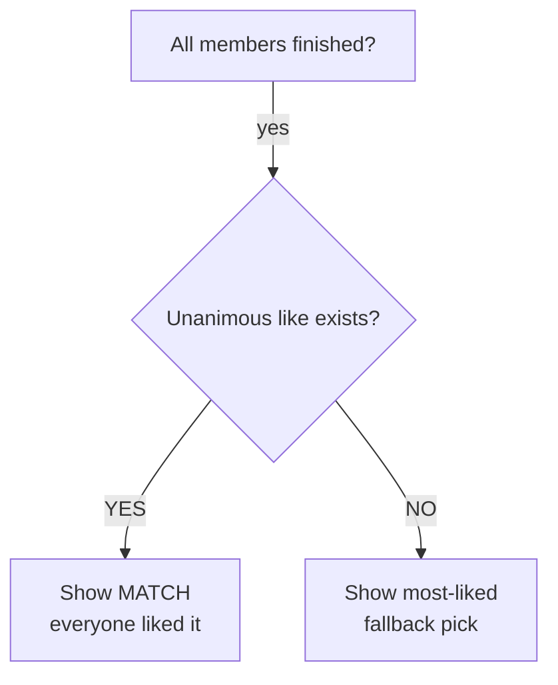

---

## 10. Milestone Plan

| Milestone | Deliverables | Status |
|-----------|--------------|:------:|
| **M1: Proof of Concept** | Auth · Places fetch · session create/join · swipe UI · most-liked result | Done |
| **M2: Prototype** | Real-time join & swipe · match-after-all-finish · filters · UI/UX | In progress |
| **M3: Extended** | Favourites · session history · combined-favourites deck · polish | Planned |

---

## 11. Software Engineering Practices

| Practice | How we apply it |
|----------|-----------------|
| **Version control** | GitHub feature branches; PRs reviewed by the other member before merge to `main`. |
| **Testing** | Unit tests for backend logic; structured user testing each milestone. |
| **Code quality** | DRY shared logic extracted; ESLint + TypeScript enforced. |
| **Single responsibility** | Each module, route, and component has one clear job. |

---

## 12. Running Locally

```bash
# 1. Install dependencies
npm run install:all

# 2. Create env files
#    backend/.env  -> SUPABASE_URL, SUPABASE_SERVICE_ROLE_KEY, GOOGLE_PLACES_API_KEY, PORT
#    mobile/.env   -> EXPO_PUBLIC_SUPABASE_URL, EXPO_PUBLIC_SUPABASE_ANON_KEY,
#                     EXPO_PUBLIC_API_URL=http://<your-LAN-ip>:3000

# 3. Run (two terminals)
npm run backend     # Express API on :3000
npm run mobile      # Expo - scan the QR with Expo Go (SDK 54)
```

> **Note:** on a physical phone, `EXPO_PUBLIC_API_URL` must use your machine's LAN IP
> (e.g. `http://192.168.x.x:3000`), not `localhost`.

